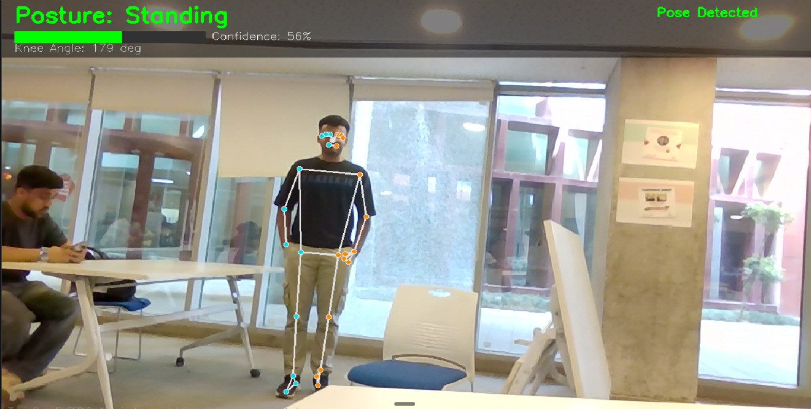
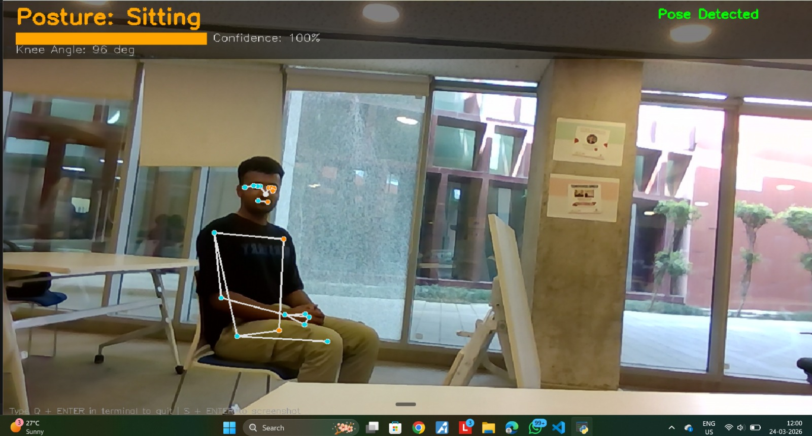

# 🧍 Real-Time Human Posture Detection System

> Detects whether a person is **Sitting** or **Standing** in real-time using a USB camera, MediaPipe pose landmarks, and a multi-rule geometric scoring system — deployed on a **Jetson Nano** edge device.

---
## 📸 Output Screenshots

**Standing Detection — Knee Angle: 179°, Confidence: 56%**



**Sitting Detection — Knee Angle: 96°, Confidence: 100%**


---
## 👤 Author
**Amit Bishnoi**
Thapar University

---

## 📌 Objective
Design a real-time human posture detection system running on a Jetson Nano (32 GB) with a USB camera to classify a person as either **Sitting** or **Standing** using computer vision and machine learning techniques.

---

## 🖥️ Hardware & Software Used

### Hardware
- **Jetson Nano (32 GB)** — Edge computing platform for on-device AI inference
- **External USB Camera** — Live video capture input

### Software
- **Python** — Primary programming language
- **OpenCV** — Video capture and frame processing
- **MediaPipe** — Real-time pose landmark detection
- **Flask** — HTTP video streaming (Jetson stream mode)
- **NumPy** — Geometric angle calculations

---

## 📁 Repository Structure

```
posture-detection-sitting-standing/
│
├── SITTING_STANDING.py     # Desktop app — live window with dark blue UI
├── requirements.txt        # Python dependencies
├── OUTPUT_1.jpeg           # Demo screenshot — Standing
├── OUTPUT_2.jpeg           # Demo screenshot — Sitting
└── README.md
```

---

## ⚙️ How It Works — Methodology

**Step 1 — Camera Integration**
OpenCV captures a live video feed from the connected USB camera.

**Step 2 — Pose Landmark Extraction**
Each frame is processed by the MediaPipe Pose model, which identifies the human body and maps 33 geometric landmark coordinates (joints) onto the person, overlaying a digital skeleton in real time.

**Step 3 — Rule-Based Classification**
The system extracts Y-axis coordinates for hip, knee, ankle, and shoulder landmarks. A weighted scoring system across 4 geometric rules determines the posture.

**Step 4 — Real-Time Overlay**
The live feed displays the detected posture label + confidence score on screen.

---

## 📐 Classification Rules (Scoring Logic)

The system uses a **4-rule weighted scoring system**. Points accumulate per rule — the class with the highest total score wins.

| Rule | Condition | Sitting | Standing |
|---|---|---|---|
| 1 — Knee Angle (hip→knee→ankle) | How bent is the knee? | < 120° → **+3** | > 160° → **+3** |
| 2 — Hip vs Knee (Y-axis) | Relative vertical position | knee_y − hip_y > −0.1 → **+2** | Hips much higher → **+2** |
| 3 — Hip Angle (shoulder→hip→knee) | Torso-to-leg angle | < 120° → **+2** | > 120° → **+2** |
| 4 — Body Ratio (ankle_y − shoulder_y) | Full vertical body spread | < 0.55 → **+2** | > 0.55 → **+2** |

> Maximum possible score: **9 points** per class. Confidence = winning score ÷ total points.

---

## 🚀 Setup & Installation

### 1. Clone the repository
```bash
git clone https://github.com/AmitBishnoi2005/posture-detection-sitting-standing.git
cd posture-detection-sitting-standing
```

### 2. Install dependencies
```bash
pip install -r requirements.txt
```

### 3. Run

**On Desktop / Laptop:**
```bash
python SITTING_STANDING.py
```
- Press `Q + ENTER` in terminal to quit
- Press `S + ENTER` to save a screenshot

**On Jetson Nano (Flask stream):**
```bash
python jetson_stream.py
```
Then open a browser on any device on the same network:
```
http://<JETSON_IP>:5000
```

---

## 📦 Dependencies

```
opencv-python
mediapipe
numpy
flask
```

---

## 🎯 Key Learning Outcomes

- ✅ **CO1** — Live camera feed with OpenCV for real-time video streaming on an edge device
- ✅ **CO2** — Applied and optimized a pretrained ML model (MediaPipe) for human pose estimation
- ✅ **CO3** — Logic-based classification using geometric landmarks and a multi-rule scoring system
- ✅ **CO4** — Full AI vision application deployed and tested on an embedded edge device (Jetson Nano)

---

## 📄 License
This project is licensed under the MIT License.
